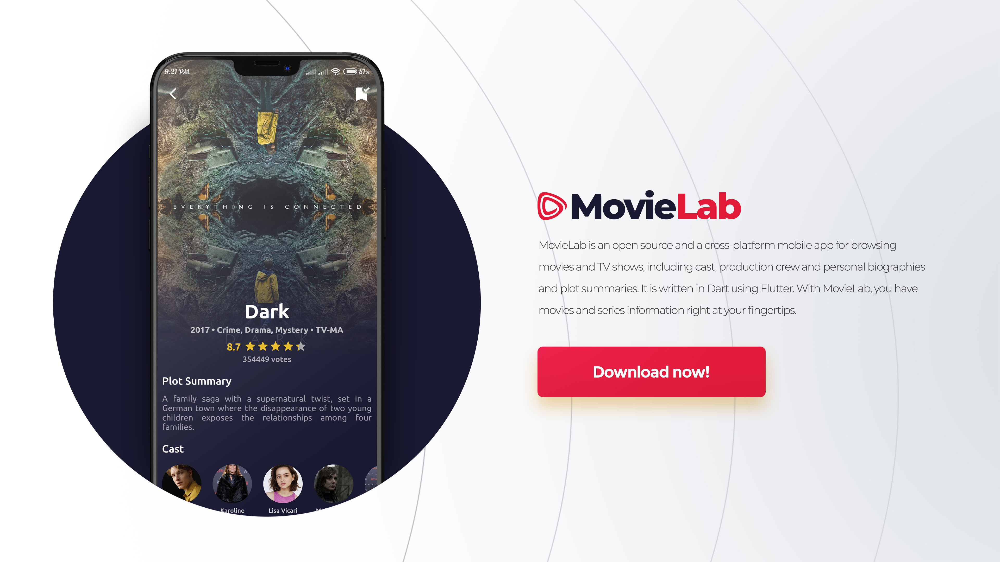

<p align="center">
  <h1 align="center">MovieLab: Movies & TV Guide</h1>

  <p align="left">
    MovieLab is an open source movie tracker and movie finder where you can find movies, series, seasons, episodes. movie recommendation and actors from the largest movie database IMDb. 
  With MovieLab, you have movies and series information right at your fingertips!
  </p>
  <p align="left">
  Do you like movies? Try MovieLab <a href="https://github.com/ErfanRht/MovieLab/releases/">here</a>, or if you are a developer click <a href="https://github.com/ErfanRht/MovieLab#getting-started">here</a>.
  </p>
</p>

[](https://github.com/ErfanRht/MovieLab/releases)

[](https://github.com/ErfanRht/MovieLab/stargazers) 
[](https://github.com/ErfanRht/MovieLab/network/members) 
[](https://github.com/ErfanRht/MovieLab/issues) 
[](https://github.com/ErfanRht/MovieLab/blob/master/LICENSE) 

<p align="center"><a href="https://github.com/ErfanRht/MovieLab/"></a>

## Screenshots

<div align="center" style="width:100%;display:flex;justify-content:space-between;">


</div>
<p> </p>
<div align="center" style="width:100%;display:flex;justify-content:space-between;">


</div>

## Download
  You can simply download it for Android from [Here](https://ErfanRht.github.io/MovieLab-Intro).
  
## Getting Started
1. If you don't have Flutter SDK installed; Please visit the official [Flutter](https://docs.flutter.dev/get-started/install) website.
2. Fetch the latest source code from the master branch.

``` 
git clone https://github.com/ErfanRht/MovieLab.git
```

3. Add api key.

<ul>

MovieLab uses the IMDb API to fetch the needed data, so before using it you have to create an account on [IMDb api website](https://imdb-api.com/Identity/Account/Register), then you can get a free api key in your profile section and apply it to the app by the below steps.

- go to `lib/.api.dart`
- you will see the code like this
```dart
List<String> apiKeys = ["XXXXXXXXXX"];
```
- replace the all `xx..` to your own api key, like this
```dart
List<String> apiKeys = ["your_api_key_here"];
```
- It's done!
</ul>

4. Run the app with Android Studio or Visual Studio. Or the command line.

``` 
flutter pub get
flutter run
```

## Contribute
If you have an issue or found a bug, please raise a GitHub issue [here](https://github.com/ErfanRht/MovieLab/issues). Pull requests are also welcome.

## License
This project is licensed under the [Apache-2.0 License](https://github.com/ErfanRht/MovieLab/blob/master/LICENSE).

## Author
This Flutter project is developed by [Erfan Rahmati](https://github.com/ErfanRht).

## Contact
You can reach out to me directly at [erfanrht2005@gmail.com](mailto:<erfanrht2005@gmail.com>).

## Supporters
[](https://github.com/ErfanRht/MovieLab/stargazers)
[](https://github.com/ErfanRht/MovieLab/network/members)

---

<div align="center">

### Show some ❤️ by starring 🌟 the repository!

</div>
